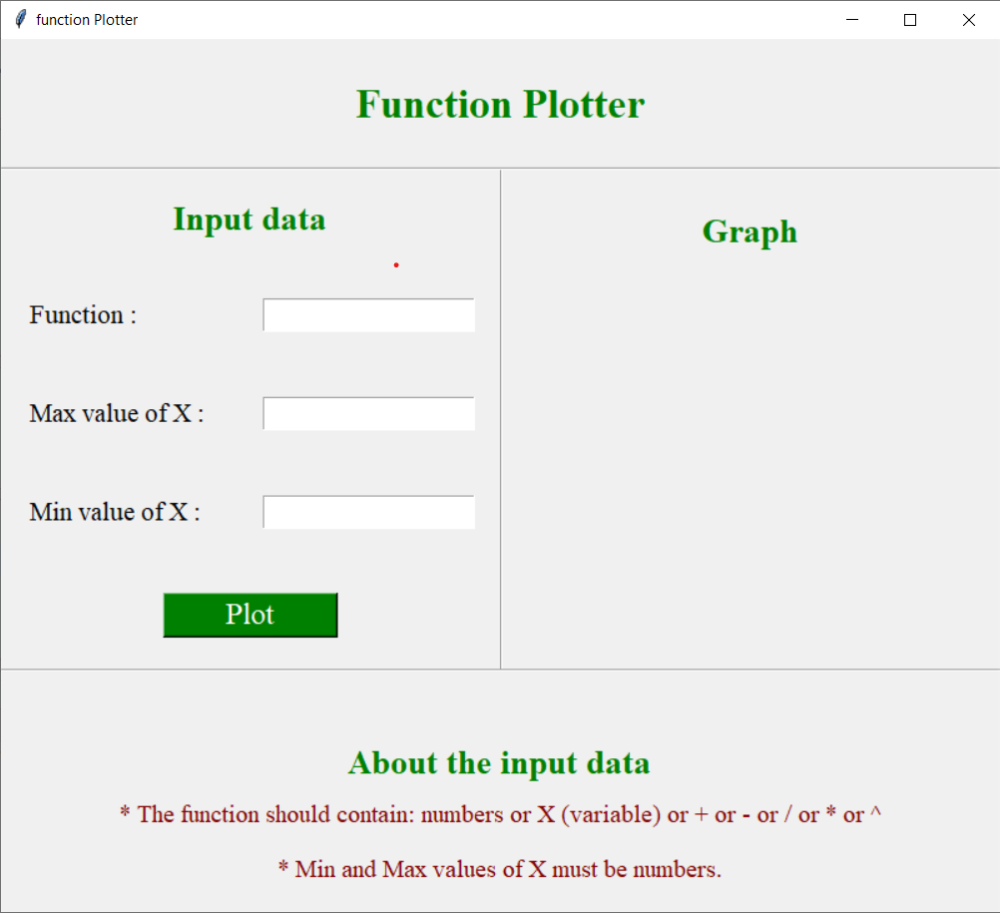
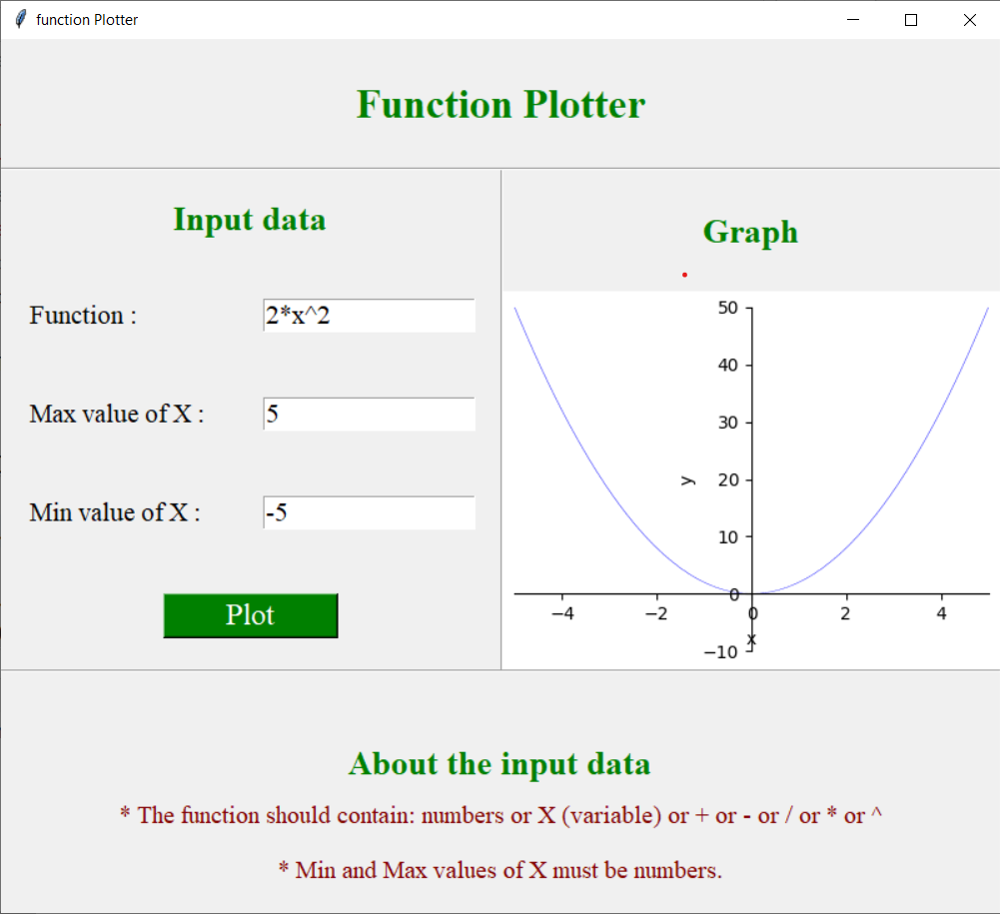
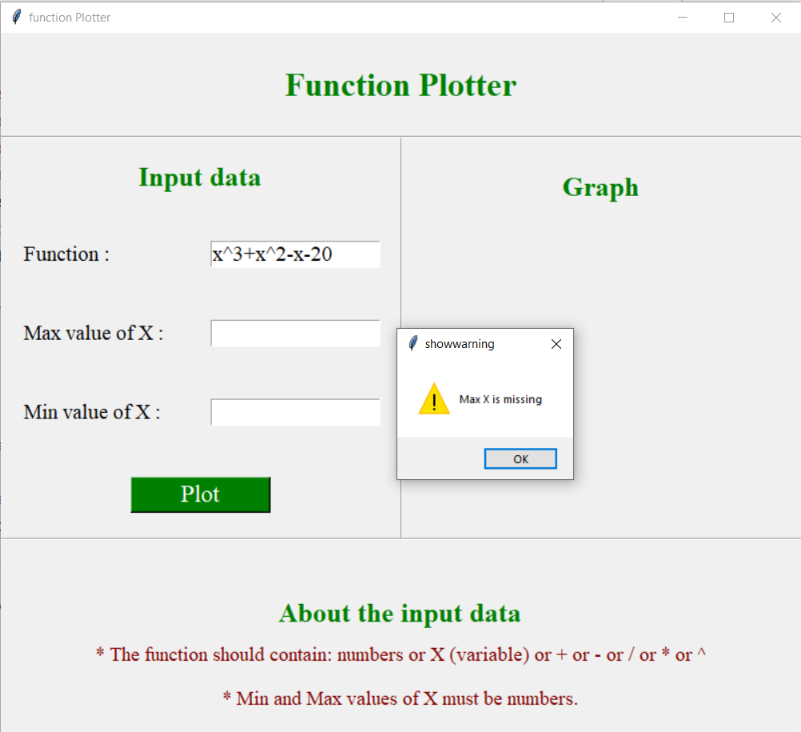

<div align="center">

# Function  Plotter

</div>

<div align="center">

[](https://www.python.org/)

</div>
<div align="center">

[](https://github.com/Abd-ELrahmanHamza/Function_plotter/contributors)
[](LICENSE)
[](https://github.com/Abd-ELrahmanHamza/Function_plotter/network)
[](https://github.com/Abd-ELrahmanHamza/Function_plotter/stargazers)
[](https://github.com/Abd-ELrahmanHamza/Function_plotter/issues)

</div>

GUI program that plots arbitrary user-entered function 

## Description
* Take a function of x from the user, e.g., 5*x^3 + 2*x. 
* Take min and max values of x from the user. 
* The following operators are supported: + - / * ^.

## Getting Started

### Dependencies

* matplotlib
* sympy

### Installing

```
git clone https://github.com/Abd-ELrahmanHamza/Function_plotter 
```

```
pip install matplotlib
```

```
pip install sympy
```


### Executing program

```
python main.py
```
### Screenshots

#### Graphs






#### Error messages




## Contributors

<table>
<tr>
<td align="center">
<a href="https://github.com/Abd-ELrahmanHamza" target="_black">
<br /><sub><b>Abdelrahman Hamza</b></sub></a><br />
</td>
</tr>
 </table>

## License

This project is licensed under the [MIT] License - see the [LICENSE.md](LICENSE) file for details
